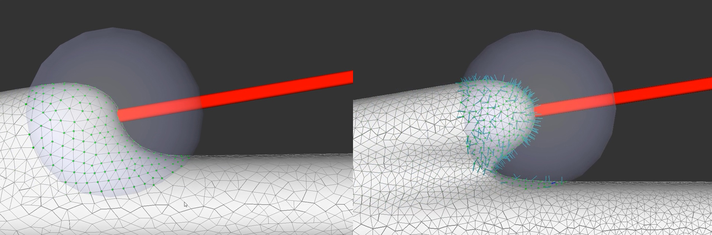

# NeuroSkelMeshEvolution

* paper: [PDF](media/NeuroSkelMeshEvolution.pdf)
* exe: [RAR](media/SetupOfSculpt3D.rar)
* online portal: coming soon
* code: github(coming soon)
* input swc files: [NeuroMorpho.Org](https://neuromorpho.org/)
* results: [XLSX](media/results.xlsx)

|      | SWC file Properties |                                                      |                   |                         |                           |                            |                           | Mesh Attributes    |                    |                    |                    |               |               |               |                         |                  |                    |                        |                               |           |             |                                                              |                                                              |      |      |      |      |      |      |      |
| ---- | ------------------- | ---------------------------------------------------- | ----------------- | ----------------------- | ------------------------- | -------------------------- | ------------------------- | ------------------- | ------------------ | ------------------ | ------------------ | ------------- | ------------- | ------------- | ----------------------- | ---------------- | ------------------ | ---------------------- | ----------------------------- | --------- | ----------- | ------------------------------------------------------------ | ------------------------------------------------------------ | ---- | ---- | ---- | ---- | ---- | ---- | ---- |
|      | NeuroMorpho.Org  ID | Cell Name                                            | Archive Name      | Species Name            | Primary Brain Region      | Average Bifurcation  Angle | Number of  Skeleton Nodes | Average Edge Length | Minimum Facet Area | Maximum Facet Area | Average Facet Area | Minimum Angle | Maximum Angle | Average Angle | Angle Mean Square Error | Number of Facets | Number of Vertices | Average Vertex Valence | Non-regular Vertex Percentage | Manifold? | Watertight? | Angle Distribution                                           | Vertex Valence Distribution                                  |      |      |      |      |      |      |      |
| 1    | NMO_128152          | L-glu-8-31-16-b0023-image                            | A. Mortensen      | rat                     | neocortex                 | 111.87°                    | 335                       | 3.42                | 0.16               | 1.83               | 0.27               | 23.23         | 131.43        | 60.00         | 16.69                   | 583048           | 291524             | 6.00                   | 79.50%                        | true      | true        |  |  |      |      |      |      |      |      |      |
| 2    | NMO_128147          | L-glu-9-9-16--b0185--image                           | A. Mortensen      | rat                     | neocortex                 | 107.21°                    | 1939                      | 2.67                | 0.27               | 1.86               | 0.27               | 22.64         | 134.44        | 60.00         | 16.68                   | 1257888          | 628946             | 6.00                   | 79.45%                        | true      | true        |  |  |      |      |      |      |      |      |      |
| 3    | NMO_128145          | L-glu-9-9-16-b0200-image                             | A. Mortensen      | rat                     | neocortex                 | 138.15°                    | 1527                      | 1.6                 | 0.33               | 1.99               | 0.27               | 21.27         | 131.07        | 60.00         | 16.68                   | 1008006          | 504001             | 6.00                   | 79.45%                        | true      | true        |  |  |      |      |      |      |      |      |      |
| 4    | NMO_128146          | L-glu-9-9-16-b0201-image                             | A. Mortensen      | rat                     | neocortex                 | 81.23°                     | 1784                      | 3.08                | 0.25               | 1.88               | 0.27               | 23.26         | 132.06        | 60.00         | 16.69                   | 1142556          | 571274             | 6.00                   | 79.40%                        | true      | true        |  |  |      |      |      |      |      |      |      |
| 5    | NMO_128150          | L-glu-9-9-16-b0206-image                             | A. Mortensen      | rat                     | neocortex                 | 98.73°                     | 2019                      | 2.4                 | 0.19               | 1.99               | 0.27               | 22.48         | 133.75        | 60.00         | 16.69                   | 1305730          | 652859             | 6.00                   | 79.44%                        | true      | true        |  |  |      |      |      |      |      |      |      |
| 6    | NMO_128148          | L-glu-9-21-16-b0044-image                            | A. Mortensen      | rat                     | neocortex                 | 118.65°                    | 1011                      | 3.35                | 0.16               | 1.96               | 0.27               | 22.57         | 129.53        | 60.00         | 16.67                   | 658150           | 329077             | 6.00                   | 79.34%                        | true      | true        |  |  |      |      |      |      |      |      |      |
| 7    | NMO_128151          | L-glu-9-21-16-b0074-image                            | A. Mortensen      | rat                     | neocortex                 | 94.2°                      | 1173                      | 4.61                | 0.26               | 1.86               | 0.27               | 23.17         | 129.22        | 60.00         | 16.68                   | 778108           | 389046             | 6.00                   | 79.25%                        | true      | true        |  |  |      |      |      |      |      |      |      |
| 8    | NMO_128149          | L-glu-11-9-16-b0056-image                            | A. Mortensen      | rat                     | neocortex                 | 139.84°                    | 718                       | 5.74                | 0.11               | 1.85               | 0.27               | 11.16         | 157.01        | 60.00         | 16.7                    | 497540           | 248766             | 6.00                   | 79.34%                        | true      | true        |  |  |      |      |      |      |      |      |      |
| 9    | NMO_128144          | L-glu-11-9-16-b0057-image                            | A. Mortensen      | rat                     | neocortex                 | 116.72°                    | 691                       | 6.09                | 0.27               | 1.87               | 0.27               | 22.56         | 130.51        | 60.00         | 16.68                   | 441540           | 220772             | 6.00                   | 79.37%                        | true      | true        |  |  |      |      |      |      |      |      |      |
| 10   | NMO_128156          | L-glu-GT949-8-31-16-e0063a-image                     | A. Mortensen      | rat                     | neocortex                 | 92.56°                     | 2037                      | 3                   | 0.17               | 1.93               | 0.27               | 22.91         | 131.99        | 60.00         | 16.68                   | 1298724          | 649358             | 6.00                   | 79.35%                        | true      | true        |  |  |      |      |      |      |      |      |      |
| 11   | NMO_128154          | L-glu-GT949-8-31-16-e0063b-image                     | A. Mortensen      | rat                     | neocortex                 | 92.99°                     | 1157                      | 4.23                | 0.15               | 1.89               | 0.27               | 5.8           | 167.5         | 60.00         | 16.69                   | 825498           | 412747             | 6.00                   | 79.51%                        | true      | true        |  |  |      |      |      |      |      |      |      |
| 12   | NMO_128161          | L-glu-Gt949-8-31-16-e0063c-image                     | A. Mortensen      | rat                     | neocortex                 | 96.05°                     | 2791                      | 2.45                | 0.21               | 1.93               | 0.27               | 16.06         | 133.19        | 60.00         | 16.67                   | 1748652          | 874324             | 6.00                   | 79.44%                        | true      | true        |  |  |      |      |      |      |      |      |      |
| 13   | NMO_128160          | L-glu-GT949-8-31-19-e0063d-image                     | A. Mortensen      | rat                     | neocortex                 | 76.86°                     | 2564                      | 2.72                | 0.15               | 1.88               | 0.27               | 20.92         | 133.49        | 60.00         | 16.67                   | 1649218          | 824609             | 6.00                   | 79.34%                        | true      | true        |  |  |      |      |      |      |      |      |      |
| 14   | NMO_166189          | ADM21-7sec5                                          | Aharon_Zuo        | mouse                   | neocortex                 | 80.19°                     | 994                       | 2.75                | 0.12               | 33.47              | 1.31               | 8.43          | 161.3         | 60.00         | 16.69                   | 2086400          | 1043196            | 6.00                   | 79.45%                        | true      | true        |  |  |      |      |      |      |      |      |      |
| 15   | NMO_166236          | ADM21-7sec6                                          | Aharon_Zuo        | mouse                   | neocortex                 | 84.81°                     | 790                       | 2.89                | 0.15               | 35.19              | 1.36               | 21.39         | 133.47        | 60.00         | 16.69                   | 2140944          | 1070472            | 6.00                   | 79.53%                        | true      | true        |  |  |      |      |      |      |      |      |      |
| 16   | NMO_166175          | ADM21-7sec7_a                                        | Aharon_Zuo        | mouse                   | neocortex                 | 73.84°                     | 252                       | 5.13                | 0.14               | 6.15               | 0.54               | 17.85         | 134.31        | 60.00         | 16.88                   | 578864           | 289434             | 6.00                   | 79.46%                        | true      | true        |  |  |      |      |      |      |      |      |      |
| 17   | NMO_166298          | ADM21-7sec7_b                                        | Aharon_Zuo        | mouse                   | neocortex                 | 81.12°                     | 158                       | 5.29                | 0.07               | 4.54               | 0.54               | 13.51         | 143.68        | 60.00         | 16.72                   | 374982           | 187493             | 6.00                   | 79.34%                        | true      | true        |  |  |      |      |      |      |      |      |      |
| 18   | NMO_166333          | ADM21-7sec7_c                                        | Aharon_Zuo        | mouse                   | neocortex                 | 57.68°                     | 254                       | 5.92                | 0.11               | 6.04               | 0.69               | 22.69         | 131.54        | 60.00         | 16.7                    | 520316           | 260160             | 6.00                   | 79.49%                        | true      | true        |  |  |      |      |      |      |      |      |      |
| 19   | NMO_166246          | ADM21-7sec7_d                                        | Aharon_Zuo        | mouse                   | neocortex                 | 60.59°                     | 169                       | 7.25                | 0.09               | 9.2                | 0.65               | 16.91         | 131.12        | 60.00         | 16.71                   | 386528           | 193266             | 6.00                   | 79.56%                        | true      | true        |  |  |      |      |      |      |      |      |      |
| 20   | NMO_166322          | ADM21-7sec7_e                                        | Aharon_Zuo        | mouse                   | neocortex                 | 64.03°                     | 256                       | 3.85                | 0.15               | 11.76              | 1                  | 15.23         | 139.24        | 60.00         | 16.69                   | 652330           | 326167             | 6.00                   | 79.36%                        | true      | true        |  |  |      |      |      |      |      |      |      |
| 21   | NMO_166166          | ADM21-7sec7_f                                        | Aharon_Zuo        | mouse                   | neocortex                 | 60.8°                      | 125                       | 6.37                | 0.09               | 3.84               | 0.36               | 15.74         | 136.63        | 60.00         | 16.75                   | 259440           | 129720             | 6.00                   | 79.70%                        | true      | true        |  |  |      |      |      |      |      |      |      |
| 22   | NMO_166104          | ADM21-7sec8                                          | Aharon_Zuo        | mouse                   | neocortex                 | 75.9°                      | 909                       | 3.06                | 0.11               | 44.66              | 1.34               | 19.05         | 134.75        | 60.00         | 16.7                    | 1778160          | 889082             | 6.00                   | 79.52%                        | true      | true        |  |  |      |      |      |      |      |      |      |
| 23   | NMO_166099          | ADM21-7sec9_a                                        | Aharon_Zuo        | mouse                   | neocortex                 | 54.75°                     | 552                       | 3.25                | 0.09               | 17.04              | 1.27               | 15.87         | 129.32        | 60.00         | 16.69                   | 1135240          | 567622             | 6.00                   | 79.50%                        | true      | true        |  |  |      |      |      |      |      |      |      |
| 24   | NMO_166309          | ADM21-7sec9_b                                        | Aharon_Zuo        | mouse                   | neocortex                 | 57.31°                     | 519                       | 2.81                | 0.12               | 38.15              | 1.15               | 15.21         | 132.43        | 60.00         | 16.7                    | 1213216          | 606610             | 6.00                   | 79.52%                        | true      | true        |  |  |      |      |      |      |      |      |      |
| 25   | NMO_166122          | ADM21-7sec10                                         | Aharon_Zuo        | mouse                   | neocortex                 | 62.44°                     | 486                       | 3.02                | 0.21               | 17.07              | 1                  | 20.58         | 138.1         | 60.00         | 16.68                   | 1631044          | 815524             | 6.00                   | 79.40%                        | true      | true        |  |  |      |      |      |      |      |      |      |
| 26   | NMO_80526           | DD13-4-C5-1                                          | Abrous            | mouse                   | hippocampus               | 53.52°                     | 134                       | 5.34                | 0.15               | 1.98               | 0.32               | 24.27         | 130.49        | 60.00         | 16.71                   | 532014           | 266009             | 6.00                   | 79.55%                        | t         | t           |  |  |      |      |      |      |      |      |      |
| 27   | NMO_80527           | DD13-4-C5-2                                          | Abrous            | mouse                   | hippocampus               | 66.11°                     | 144                       | 4.78                | 0.17               | 2.05               | 0.3                | 24.25         | 129.41        | 60.00         | 16.69                   | 724990           | 362495             | 6.00                   | 79.50%                        | t         | t           |  |  |      |      |      |      |      |      |      |
| 28   | NMO_80528           | DD13-4-C5-3                                          | Abrous            | mouse                   | hippocampus               | 62.26°                     | 130                       | 2.55                | 0.33               | 3.44               | 0.28               | 21.65         | 134.44        | 60.00         | 16.66                   | 660108           | 330056             | 6.00                   | 79.28%                        | t         | t           |  |  |      |      |      |      |      |      |      |
| 29   | NMO_80529           | DD13-4-C5-4                                          | Abrous            | mouse                   | hippocampus               | 57.98°                     | 123                       | 3.73                | 0.29               | 1.91               | 0.28               | 23.77         | 131.23        | 60.00         | 16.7                    | 555260           | 277626             | 6.00                   | 79.55%                        | t         | t           |  |  |      |      |      |      |      |      |      |
| 30   | NMO_80530           | DD13-4-C5-5                                          | Abrous            | mouse                   | hippocampus               | 49.66°                     | 172                       | 4.47                | 0.17               | 1.96               | 0.3                | 23.46         | 130.8         | 60.00         | 16.67                   | 569106           | 281555             | 6.00                   | 79.47%                        | t         | t           |  |  |      |      |      |      |      |      |      |
| 31   | NMO_80531           | DD13-4-c6-1                                          | Abrous            | mouse                   | hippocampus               | 60.14°                     | 181                       | 1.32                | 0.29               | 11.94              | 0.5                | 21.84         | 136.03        | 60.00         | 16.68                   | 2475688          | 1237846            | 6.00                   | 79.40%                        | t         | t           |  |  |      |      |      |      |      |      |      |
| 32   | NMO_80532           | DD13-4-c6-2                                          | Abrous            | mouse                   | hippocampus               | 45.08°                     | 135                       | 1.19                | 0.29               | 14.91              | 0.61               | 21.5          | 132.73        | 60.00         | 16.67                   | 2183658          | 1091831            | 6.00                   | 79.41%                        | t         | t           |  |  |      |      |      |      |      |      |      |
| 33   | NMO_80533           | DD13-4-c6-3                                          | Abrous            | mouse                   | hippocampus               | 51.96°                     | 121                       | 1.26                | 0.28               | 13.43              | 0.61               | 22.59         | 133.3         | 60.00         | 16.68                   | 1811686          | 905845             | 6.00                   | 79.39%                        | t         | t           |  |  |      |      |      |      |      |      |      |
| 34   | NMO_80534           | DD13-4-c6-4                                          | Abrous            | mouse                   | hippocampus               | 48.01°                     |                           |                     |                    |                    |                    |               |               |               |                         |                  |                    |                        |                               |           |             |                                                              |                                                              |      |      |      |      |      |      |      |
| 35   | NMO_80535           | DD13-4-c6-5                                          | Abrous            | mouse                   | hippocampus               | 67.17°                     | 108                       |                     |                    |                    |                    |               |               |               |                         |                  |                    |                        |                               |           |             |                                                              |                                                              |      |      |      |      |      |      |      |
| 36   | NMO_80536           | DD13-4-c7-1                                          | Abrous            | mouse                   | hippocampus               | 53.76°                     | 125                       |                     |                    |                    |                    |               |               |               |                         |                  |                    |                        |                               |           |             |                                                              |                                                              |      |      |      |      |      |      |      |
| 37   | NMO_80537           | DD13-4-c7-2                                          | Abrous            | mouse                   | hippocampus               | 48.23°                     | 200                       |                     |                    |                    |                    |               |               |               |                         |                  |                    |                        |                               |           |             |                                                              |                                                              |      |      |      |      |      |      |      |
| 38   | NMO_80538           | DD13-4-c7-3                                          | Abrous            | mouse                   | hippocampus               | 56.03°                     |                           |                     |                    |                    |                    |               |               |               |                         |                  |                    |                        |                               |           |             |                                                              |                                                              |      |      |      |      |      |      |      |
| 39   | NMO_80539           | DD13-4-c7-4                                          | Abrous            | mouse                   | hippocampus               | 75.49°                     | 132                       |                     |                    |                    |                    |               |               |               |                         |                  |                    |                        |                               |           |             |                                                              |                                                              |      |      |      |      |      |      |      |
| 40   | NMO_80540           | DD13-4-c8-1                                          | Abrous            | mouse                   | hippocampus               | 48.02°                     | 178                       |                     |                    |                    |                    |               |               |               |                         |                  |                    |                        |                               |           |             |                                                              |                                                              |      |      |      |      |      |      |      |
| 41   | NMO_80541           | DD13-4-c8-2                                          | Abrous            | mouse                   | hippocampus               | 61°                        |                           |                     |                    |                    |                    |               |               |               |                         |                  |                    |                        |                               |           |             |                                                              |                                                              |      |      |      |      |      |      |      |
| 42   | NMO_80542           | DD13-4-c8-3                                          | Abrous            | mouse                   | hippocampus               | 56.35°                     | 145                       |                     |                    |                    |                    |               |               |               |                         |                  |                    |                        |                               |           |             |                                                              |                                                              |      |      |      |      |      |      |      |
| 43   | NMO_80543           | DD13-4-c8-4                                          | Abrous            | mouse                   | hippocampus               | 64.72°                     | 165                       |                     |                    |                    |                    |               |               |               |                         |                  |                    |                        |                               |           |             |                                                              |                                                              |      |      |      |      |      |      |      |
| 44   | NMO_151978          | 10_2REDO-850-GM18-Ctl-Ctl-Chow-BNL16A-CA1_Finished2a | Acharya           | mouse                   | hippocampus               | 48.34°                     | 2463                      | 3.35                | 0.07               | 9.98               | 0.7                | 6.4           | 166.74        | 60.00         | 16.82                   | 2060544          | 1030264            | 6.00                   | 79.14%                        | true      | true        |  |  |      |      |      |      |      |      |      |
| 45   | NMO_151974          | 10_2REDO-850-GM18-Ctl-Ctl-Chow-BNL16A-CA1_Finished2b | Acharya           | mouse                   | hippocampus               | 52.44°                     | 2435                      | 3.33                | 0.07               | 10.05              | 0.61               | 3.3           | 173.39        | 60.00         | 16.77                   | 2253558          | 1126775            | 6.00                   | 79.09%                        | true      | true        |  |  |      |      |      |      |      |      |      |
| 46   | NMO_151983          | 10_2REDO-850-GM18-Ctl-Ctl-Chow-BNL16A-CA1_Finished2c | Acharya           | mouse                   | hippocampus               | 64.05°                     | 1057                      | 4.63                | 0.13               | 11.22              | 0.75               | 4.04          | 171.91        | 60.00         | 16.83                   | 778330           | 389161             | 6.00                   | 78.87%                        | true      | true        |  |  |      |      |      |      |      |      |      |
| 47   | NMO_152009          | 10_2REDO-850-GM18-Ctl-Ctl-Chow-BNL16A-CA1_Finished2d | Acharya           | mouse                   | hippocampus               | 55.63°                     | 1864                      | 3.58                | 0.07               | 10.88              | 0.77               | 8.91          | 159.72        | 60.00         | 16.81                   | 1702630          | 851313             | 6.00                   | 79.15%                        | true      | true        |  |  |      |      |      |      |      |      |      |
| 48   | NMO_152017          | 10_2REDO-850-GM18-Ctl-Ctl-Chow-BNL16A-CA1_Finished2e | Acharya           | mouse                   | hippocampus               | 48.42°                     | 225                       | 13.09               | 0.02               | 7.67               | 0.72               | 10.01         | 156.57        | 60.00         | 16.82                   | 353164           | 176582             | 6.00                   | 79.69%                        | true      | true        |  |  |      |      |      |      |      |      |      |
| 49   | NMO_152011          | 10_2REDO-850-GM18-Ctl-Ctl-Chow-BNL16A-CA1_Finished2f | Acharya           | mouse                   | hippocampus               | 46.86°                     | 86                        | 22.63               | 0.01               | 5.02               | 0.62               | 22.89         | 128.69        | 60.00         | 16.82                   | 77352            | 38678              | 6.00                   | 79.95%                        | true      | true        |  |  |      |      |      |      |      |      |      |
| 50   | NMO_152038          | 10_2REDO-850-GM18-Ctl-Ctl-Chow-BNL16A-CA1_Finished2g | Acharya           | mouse                   | hippocampus               | 62.27°                     | 252                       | 7.28                | 0.04               | 8.33               | 0.59               | 71.46         | 137.3         | 60.00         | 16.9                    | 291416           | 145704             | 6.00                   | 79.63%                        | t         | t           |  |  |      |      |      |      |      |      |      |
| 51   | NMO_151981          | 10_2REDO-850-GM18-Ctl-Ctl-Chow-BNL16A-CA1_Finished2h | Acharya           | mouse                   | hippocampus               | 24.05°                     | 879                       | 5.86                | 0.09               | 9.94               | 0.69               | 7.89          | 159.91        | 60.00         | 16.98                   | 864596           | 432300             | 6.00                   | 79.96%                        | t         | t           |  |  |      |      |      |      |      |      |      |
| 52   | NMO_151968          | 10_2REDO-850-GM18-Ctl-Ctl-Chow-BNL16A-CA1_Finished2i | Acharya           | mouse                   | hippocampus               | 49.51°                     | 3139                      |                     |                    |                    |                    |               |               |               |                         |                  |                    |                        |                               |           |             |                                                              |                                                              |      |      |      |      |      |      |      |
| 53   | NMO_151942          | 10_663-He-30cGy-Ctl-Chow-10-12-2016-CA1_Finished2a   | Acharya           | mouse                   | hippocampus               | 45.07°                     | 1693                      | 4.72                | 0.04               | 10.7               | 0.76               | 2.88          | 172.27        | 60.00         | 16.78                   | 2242264          | 1121132            | 6.00                   | 79.16%                        | t         | t           |  |  |      |      |      |      |      |      |      |
| 54   | NMO_152026          | 10_663-He-30cGy-Ctl-Chow-10-12-2016-CA1_Finished2b   | Acharya           | mouse                   | hippocampus               | 41.67°                     | 1654                      |                     |                    |                    |                    |               |               |               |                         |                  |                    |                        |                               |           |             |                                                              |                                                              |      |      |      |      |      |      |      |
| 55   | NMO_152002          | 10_663-He-30cGy-Ctl-Chow-10-12-2016-CA1_Finished2c   | Acharya           | mouse                   | hippocampus               | 34.36°                     | 518                       | 4.3                 | 0.06               | 11.43              | 0.91               | 10.48         | 156.99        | 60.00         | 17.31                   | 641934           | 320963             | 6.00                   | 80.90%                        | t         | t           |  |  |      |      |      |      |      |      |      |
| 56   | NMO_151965          | 10_666-GM9-He-Ctl-Chow-BNL16A-CA1Finished2a          | Acharya           | mouse                   | hippocampus               | 44.98°                     | 1692                      | 4.27                | 0.1                | 11.06              | 0.76               | 6.61          | 164.29        | 60.00         | 16.77                   | 2239056          | 1119530            | 6.00                   | 79.15%                        | t         | t           |  |  |      |      |      |      |      |      |      |
| 57   | NMO_152031          | 10_666-GM9-He-Ctl-Chow-BNL16A-CA1Finished2b          | Acharya           | mouse                   | hippocampus               | 44.82°                     | 2054                      | 3.68                | 0.06               | 10.31              | 0.81               | 3.61          | 172.19        | 60.00         | 16.84                   | 2307322          | 1153659            | 6.00                   | 79.40%                        | t         | t           |  |  |      |      |      |      |      |      |      |
| 58   | NMO_152035          | 10_666-GM9-He-Ctl-Chow-BNL16A-CA1Finished2c          | Acharya           | mouse                   | hippocampus               | 41.09°                     | 1319                      | 4.06                | 0.11               | 10.44              | 0.77               | 8.43          | 161.54        | 60.00         | 16.77                   | 1131230          | 865615             | 6.00                   | 79.18%                        | t         | t           |  |  |      |      |      |      |      |      |      |
| 59   | NMO_104597          | block_7286                                           | Bock              | drosophila melanogaster | protocerebrum             | 88.62°                     | 3078                      | 2.32                | 0.12               | 1.93               | 0.27               | 20.13         | 139.48        | 60.00         | 16.67                   | 1891242          | 945613             | 6.00                   | 79.27%                        | t         | t           |  |  |      |      |      |      |      |      |      |
| 60   | NMO_104602          | block_7646                                           | Bock              | drosophila melanogaster | protocerebrum             | 97.92°                     | 3700                      | 2.17                | 0.11               | 2                  | 0.27               | 19.7          | 135.7         | 60.00         | 16.66                   | 2286366          | 1143175            | 6.00                   | 79.31%                        | t         | t           |  |  |      |      |      |      |      |      |      |
| 61   | NMO_104610          | block_9578                                           | Bock              | drosophila melanogaster | protocerebrum             | 87.57°                     | 2979                      | 2.63                | 0.1                | 1.96               | 0.27               | 20.22         | 138.99        | 60.00         | 16.65                   | 1149778          | 724863             | 6.00                   | 79.10%                        | t         | t           |  |  |      |      |      |      |      |      |      |
| 62   | NMO_104600          | block_11742                                          | Bock              | drosophila melanogaster | protocerebrum             | 90.93°                     | 3223                      | 2.65                | 0.09               | 2.17               | 0.27               | 18.9          | 136.49        | 60.00         | 16.68                   | 1903640          | 951814             | 6.00                   | 79.39%                        | t         | t           |  |  |      |      |      |      |      |      |      |
| 63   | NMO_104601          | block_12874                                          | Bock              | drosophila melanogaster | protocerebrum             | 94.24°                     | 2255                      | 2.9                 | 0.1                | 2.1                | 0.27               | 22.01         | 135.07        | 60.00         | 16.68                   | 2157832          | 1078912            | 6.00                   | 79.33%                        | t         | t           |  |  |      |      |      |      |      |      |      |
| 64   | NMO_104604          | block_13018                                          | Bock              | drosophila melanogaster | protocerebrum             | 78.9°                      | 3302                      | 2.64                | 0.1                | 2.14               | 0.27               | 15.81         | 147.99        | 60.00         | 16.64                   | 2009456          | 1004706            | 6.00                   | 79.12%                        | t         | t           |  |  |      |      |      |      |      |      |      |
| 65   | NMO_104598          | block_16406                                          | Bock              | drosophila melanogaster | protocerebrum             | 94.56°                     | 2584                      | 2.24                | 0.1                | 1.92               | 0.27               | 17.81         | 134.89        | 60.00         | 16.66                   | 1732154          | 866075             | 6.00                   | 79.22%                        | t         | t           |  |  |      |      |      |      |      |      |      |
| 66   | NMO_104626          | block_30591                                          | Bock              | drosophila melanogaster | protocerebrum             | 94.59°                     | 13631                     |                     |                    |                    |                    |               |               |               |                         | 1237510          | 618753             |                        |                               |           |             |                                                              |                                                              |      |      |      |      |      |      |      |
| 67   | NMO_104612          | block_60445                                          | Bock              | drosophila melanogaster | protocerebrum             | 99.13°                     | 8902                      |                     |                    |                    |                    |               |               |               |                         | 1770308          | 885134             |                        |                               |           |             |                                                              |                                                              |      |      |      |      |      |      |      |
| 68   | NMO_104599          | block_175032                                         | Bock              | drosophila melanogaster | protocerebrum             | 92.48°                     | 1543                      | 2.77                | 0.11               | 1.89               | 0.27               | 18.72         | 140.79        | 60.00         | 16.67                   | 2131504          | 1065744            | 6.00                   | 79.26%                        | t         | t           |  |  |      |      |      |      |      |      |      |
| 69   | NMO_104538          | block_203840                                         | Bock              | drosophila melanogaster | protocerebrum             | 100.52°                    | 95498                     |                     |                    |                    |                    |               |               |               |                         |                  |                    |                        |                               |           |             |                                                              |                                                              |      |      |      |      |      |      |      |
| 70   | NMO_104608          | block_205947                                         | Bock              | drosophila melanogaster | protocerebrum             | 99.53°                     | 3868                      |                     |                    |                    |                    |               |               |               |                         |                  |                    |                        |                               |           |             |                                                              |                                                              |      |      |      |      |      |      |      |
| 71   | NMO_104605          | block_424295                                         | Bock              | drosophila melanogaster | protocerebrum             | 98.07°                     | 2482                      | 2.1                 | 0.15               | 1.96               | 0.27               | 15.94         | 142.87        | 60.00         | 16.65                   | 1770308          | 885134             | 6.00                   | 79.24%                        | t         | t           |  |  |      |      |      |      |      |      |      |
| 72   | NMO_104607          | block_424379                                         | Bock              | drosophila melanogaster | protocerebrum             | 98.47°                     | 2783                      | 2.43                | 0.13               | 1.98               | 0.27               | 10.54         | 158.41        | 60.00         | 16.66                   | 2131504          | 1065744            | 6.00                   | 79.27%                        | t         | t           |  |  |      |      |      |      |      |      |      |
| 73   | NMO_104606          | block_515387                                         | Bock              | drosophila melanogaster | protocerebrum             | 95.15°                     | 3334                      |                     |                    |                    |                    |               |               |               |                         |                  |                    |                        |                               |           |             |                                                              |                                                              |      |      |      |      |      |      |      |
| 74   | NMO_80592           | 1aPN1aPNleft_7865696                                 | Cardona           | drosophila melanogaster | protocerebrum             | 93.5°                      | 1056                      | 7                   | 0.14               | 2                  | 0.28               | 17.99         | 142.57        | 60.00         | 16.64                   | 492500           | 246269             | 6                      | 79.12%                        | t         | t           |  |  |      |      |      |      |      |      |      |
| 75   | NMO_80568           | 1aPN1aPNright_8252067                                | Cardona           | drosophila melanogaster | protocerebrum             | 83.72°                     | 1191                      | 6.99                | 0.19               | 1.92               | 0.27               | 22.72         | 129.48        | 60.00         | 16.66                   | 546882           | 273431             | 6                      | 79.18%                        | t         | t           |  |  |      |      |      |      |      |      |      |
| 76   | NMO_80591           | 13aPN13aPNleft_4493199                               | Cardona           | drosophila melanogaster | protocerebrum             | 97.2°                      | 1181                      | 7.61                | 0.35               | 1.94               | 0.27               | 20.26         | 138.23        | 60.00         | 16.64                   | 566936           | 283458             | 6                      | 79.04%                        | t         | t           |  |  |      |      |      |      |      |      |      |
| 77   | NMO_80567           | 13aPN13aPNright_8244823                              | Cardona           | drosophila melanogaster | protocerebrum             | 93.28°                     | 1466                      | 7.44                | 0.09               | 1.98               | 0.27               | 3.07          | 163.29        | 60.00         | 16.64                   | 656904           | 328430             | 6                      | 79.05%                        | t         | t           |  |  |      |      |      |      |      |      |      |
| 79   | NMO_80569           | 22cPN22cPNright_8248631                              | Cardona           | drosophila melanogaster | protocerebrum             | 85.74°                     | 1282                      | 7.3                 | 0.14               | 1.95               | 0.27               | 19.01         | 139.93        | 60.00         | 16.65                   | 621406           | 310699             | 6.00                   | 79.19%                        | t         | t           |  |  |      |      |      |      |      |      |      |
| 78   | NMO_80593           | 22cPN22cPNleft_7865652                               | Cardona           | drosophila melanogaster | protocerebrum             | 97.01°                     | 1265                      |                     |                    |                    |                    |               |               |               |                         |                  |                    |                        |                               |           |             |                                                              |                                                              |      |      |      |      |      |      |      |
| 80   | NMO_80594           | 24aPN24aPNleft_7198338                               | Cardona           | drosophila melanogaster | protocerebrum             | 102°                       | 1107                      |                     |                    |                    |                    |               |               |               |                         |                  |                    |                        |                               |           |             |                                                              |                                                              |      |      |      |      |      |      |      |
| 81   | NMO_80570           | 24aPN24aPNright_8245869                              | Cardona           | drosophila melanogaster | protocerebrum             | 98.15°                     | 1253                      |                     |                    |                    |                    |               |               |               |                         |                  |                    |                        |                               |           |             |                                                              |                                                              |      |      |      |      |      |      |      |
| 82   | NMO_80595           | 30aPN30aPNleft_7916593                               | Cardona           | drosophila melanogaster | protocerebrum             | 97.71°                     | 1218                      |                     |                    |                    |                    |               |               |               |                         |                  |                    |                        |                               |           |             |                                                              |                                                              |      |      |      |      |      |      |      |
| 83   | NMO_80571           | 30aPN30aPNright_8256186                              | Cardona           | drosophila melanogaster | protocerebrum             | 89.89°                     | 1403                      |                     |                    |                    |                    |               |               |               |                         |                  |                    |                        |                               |           |             |                                                              |                                                              |      |      |      |      |      |      |      |
| 84   | NMO_80596           | 33aPN33aPNleft_8021456                               | Cardona           | drosophila melanogaster | protocerebrum             | 86.35°                     | 1490                      |                     |                    |                    |                    |               |               |               |                         |                  |                    |                        |                               |           |             |                                                              |                                                              |      |      |      |      |      |      |      |
| 85   | NMO_80572           | 33aPN33aPNright_13589251                             | Cardona           | drosophila melanogaster | protocerebrum             | 89.4°                      | 1927                      |                     |                    |                    |                    |               |               |               |                         |                  |                    |                        |                               |           |             |                                                              |                                                              |      |      |      |      |      |      |      |
| 86   | NMO_80619           | 35aPN35aPNbilateralleft_7934904                      | Cardona           | drosophila melanogaster | protocerebrum             | 96.57°                     | 2551                      |                     |                    |                    |                    |               |               |               |                         |                  |                    |                        |                               |           |             |                                                              |                                                              |      |      |      |      |      |      |      |
| 87   | NMO_80615           | 35aPN35aPNbilateralright_7935088                     | Cardona           | drosophila melanogaster | protocerebrum             | 97.84°                     | 2337                      |                     |                    |                    |                    |               |               |               |                         |                  |                    |                        |                               |           |             |                                                              |                                                              |      |      |      |      |      |      |      |
| 88   | NMO_133662          | 16119_19_2                                           | Baier             | zebrafish               | optic lobe                | 73.18°                     | 232                       | 20.71               | 0.01               | 6.12               | 0.65               | 16.13         | 146.36        | 60.00         | 17.16                   | 122358           | 61181              | 6.00                   | 80.36%                        | t         | t           |  |  |      |      |      |      |      |      |      |
| 89   | NMO_132730          | 150324_fixed_10_2_full_tracing                       | Baier             | zebrafish               | optic lobe                | 72.75°                     | 79                        | 22.82               | 0.01               | 7.67               | 0.81               | 13            | 145.17        | 60.00         | 17.02                   | 71278            | 36141              | 6.00                   | 79.91%                        | t         | t           |  |  |      |      |      |      |      |      |      |
| 90   | NMO_132724          | 150324_fixed_19_2a_full_tracing                      | Baier             | zebrafish               | optic lobe                | 82.51°                     | 87                        | 24.74               | 0.01               | 4.51               | 0.6                | 18.41         | 136.47        | 60.00         | 16.95                   | 67464            | 33730              | 6.00                   | 79.48%                        | t         | t           |  |  |      |      |      |      |      |      |      |
| 91   | NMO_132731          | 150324_fixed_20_1_full_tracing                       | Baier             | zebrafish               | optic lobe                | 62.24°                     | 91                        | 32.64               | 0                  | 4.19               | 0.69               | 18.05         | 132.16        | 60.00         | 17.04                   | 67562            | 33779              | 6.00                   | 79.88%                        | t         | t           |  |  |      |      |      |      |      |      |      |
| 92   | NMO_132727          | 150609_354_fixed_12_1a_full_tracing                  | Baier             | zebrafish               | optic lobe                | 80.05°                     | 214                       | 18.1                | 0.01               | 7                  | 0.71               | 6.1           | 165.24        | 60.00         | 16.97                   | 182968           | 91486              | 6.00                   | 80.08%                        | t         | t           |  |  |      |      |      |      |      |      |      |
| 93   | NMO_132729          | 150616_fixed_354_3_2_full_tracing                    | Baier             | zebrafish               | optic lobe                | 94.4°                      | 96                        | 25.92               | 0.01               | 5.29               | 0.82               | 20.84         | 129.2         | 60.00         | 17.13                   | 89508            | 44754              | 6.00                   | 80.14%                        | t         | t           |  |  |      |      |      |      |      |      |      |
| 94   | NMO_132732          | 150714_5_4a_full_tracing                             | Baier             | zebrafish               | optic lobe                | 115.53°                    | 87                        | 20.527              | 0.01               | 6.48               | 0.65               | 18.76         | 131.69        | 60.00         | 16.69                   | 90040            | 450022             | 6.00                   | 79.98%                        | t         | t           |  |  |      |      |      |      |      |      |      |
| 95   | NMO_132720          | 151124_2_5                                           | Baier             | zebrafish               | optic lobe                | 93.34°                     | 418                       | 24.37               | 0.01               | 9.13               | 0.72               | 14.98         | 141.68        | 60.00         | 17.73                   | 93058            | 46531              | 6.00                   | 80.84%                        | t         | t           |  |  |      |      |      |      |      |      |      |
| 96   | NMO_132716          | 151130_5_1                                           | Baier             | zebrafish               | optic lobe                | 92.95°                     | 147                       | 24.83               | 0.01               | 7.88               | 0.84               | 11.46         | 138.52        | 60.00         | 17.09                   | 76856            | 38430              | 6.00                   | 79.86%                        | t         | t           |  |  |      |      |      |      |      |      |      |
| 97   | NMO_132718          | 151130_8_2                                           | Baier             | zebrafish               | optic lobe                | 90.71°                     | 155                       | 24.98               | 0.01               | 5.54               | 0.72               | 20.28         | 131.99        | 60.00         | 17.2                    | 82540            | 40266              | 6.00                   | 80.66%                        | t         | t           |  |  |      |      |      |      |      |      |      |
| 98   | NMO_132721          | 151130_13_1                                          | Baier             | zebrafish               | optic lobe                | 55.59°                     | 43                        | 50.84               | 0                  | 13                 | 1.67               | 7.62          | 160.15        | 60.00         | 17.37                   | 42458            | 21231              | 6.00                   | 80.88%                        | t         | t           |  |  |      |      |      |      |      |      |      |
| 99   | NMO_132723          | 151130_13_2                                          | Baier             | zebrafish               | optic lobe                | 73.38°                     | 248                       | 19.97               | 0.01               | 5.58               | 0.69               | 10.72         | 153.07        | 60.00         | 17                      | 100146           | 50075              | 6.00                   | 79.80%                        | t         | t           |  |  |      |      |      |      |      |      |      |
| 100  | NMO_132726          | 151208_9_4                                           | Baier             | zebrafish               | optic lobe                | 99.14°                     | 114                       | 55.56               | 0                  | 10.35              | 1.23               | 8.09          | 158.25        | 60.00         | 18.19                   | 39454            | 19729              | 6.00                   | 82.44%                        | t         | t           |  |  |      |      |      |      |      |      |      |
| 101  | NMO_133660          | 160502_7_1_corrected                                 | Baier             | zebrafish               | optic lobe                | 69.5°                      | 79                        | 25.59               | 0.01               | 11                 | 0.84               | 11.27         | 151.79        | 60.00         | 17.33                   | 63470            | 31737              | 6.00                   | 81.53%                        | t         | t           |  |  |      |      |      |      |      |      |      |
| 102  | NMO_133675          | 160502_9_4_complemented                              | Baier             | zebrafish               | optic lobe                | 77.87°                     | 542                       | 11.82               | 0.03               | 10.19              | 0.64               | 4.96          | 167.23        | 60.00         | 17.06                   | 280478           | 140299             | 6.00                   | 80.07%                        | t         | t           |  |  |      |      |      |      |      |      |      |
| 103  | NMO_01890           | dCH-cobalt                                           | Borst             | blowfly                 | optic lobe                | 94.88°                     | 6248                      | 5.1                 | 0.01               | 71.61              | 2.02               | 1.4           | 175.34        | 60.00         | 17.04                   | 1754310          | 876638             | 6.00                   | 78.63%                        | t         | t           |  |  |      |      |      |      |      |      |      |
| 104  | NMO_51004           | dHSE_01l                                             | Borst             | drosophila melanogaster | optic lobe                | 68.66°                     | 3224                      | 9.71                | 0.02               | 195.48             | 4.27               | 5.26          | 165.61        | 60.00         | 17                      | 693634           | 346819             | 6.00                   | 79.27%                        | t         | t           |  |  |      |      |      |      |      |      |      |
| 105  | NMO_50994           | dHSE_01r                                             | Borst             | drosophila melanogaster | optic lobe                | 75.74°                     | 3480                      | 11.59               | 0.01               | 113.71             | 2.87               | 2.08          | 175.66        | 60.00         | 16.94                   | 669178           | 334591             | 6.00                   | 78.82%                        | t         | t           |  |  |      |      |      |      |      |      |      |
| 106  | NMO_51005           | dHSE_02l                                             | Borst             | drosophila melanogaster | optic lobe                | 73.58°                     | 3465                      | 9.15                | 0.02               | 187.97             | 3.35               | 0.99          | 177.73        | 60.00         | 16.97                   | 771402           | 385703             | 6.00                   | 78.91%                        | t         | t           |  |  |      |      |      |      |      |      |      |
| 107  | NMO_50995           | dHSE_02r                                             | Borst             | drosophila melanogaster | optic lobe                | 76.18°                     | 2181                      | 12.05               | 0.01               | 129.89             | 3.62               | 0.32          | 178.17        | 60.00         | 17.04                   | 497050           | 248521             | 6.00                   | 79.19%                        | t         | t           |  |  |      |      |      |      |      |      |      |
| 108  | NMO_51006           | dHSE_03l                                             | Borst             | drosophila melanogaster | optic lobe                | 73.42°                     | 2116                      |                     |                    |                    |                    |               |               |               |                         | 535418           | 267711             |                        |                               |           |             |                                                              |                                                              |      |      |      |      |      |      |      |
| 109  | NMO_50996           | dHSE_03r                                             | Borst             | drosophila melanogaster | optic lobe                | 72.5°                      | 2169                      |                     |                    |                    |                    |               |               |               |                         | 582192           | 291098             |                        |                               |           |             |                                                              |                                                              |      |      |      |      |      |      |      |
| 110  | NMO_51007           | dHSE_04l                                             | Borst             | drosophila melanogaster | optic lobe                | 72.07°                     | 3246                      |                     |                    |                    |                    |               |               |               |                         | 910332           | 455168             |                        |                               |           |             |                                                              |                                                              |      |      |      |      |      |      |      |
| 111  | NMO_50997           | dHSE_04r                                             | Borst             | drosophila melanogaster | optic lobe                | 72.92°                     | 2992                      |                     |                    |                    |                    |               |               |               |                         | 547822           | 273911             |                        |                               |           |             |                                                              |                                                              |      |      |      |      |      |      |      |
| 112  | NMO_51008           | dHSE_05l                                             | Borst             | drosophila melanogaster | optic lobe                | 75.5°                      | 4661                      |                     |                    |                    |                    |               |               |               |                         |                  |                    |                        |                               |           |             |                                                              |                                                              |      |      |      |      |      |      |      |
| 113  | NMO_50998           | dHSE_05r                                             | Borst             | drosophila melanogaster | optic lobe                | 73.19°                     | 3692                      |                     |                    |                    |                    |               |               |               |                         | 779210           | 389607             |                        |                               |           |             |                                                              |                                                              |      |      |      |      |      |      |      |
| 114  | NMO_51009           | dHSN_01l                                             | Borst             | drosophila melanogaster | optic lobe                | 68.25°                     | 2580                      |                     |                    |                    |                    |               |               |               |                         | 554602           | 277303             |                        |                               |           |             |                                                              |                                                              |      |      |      |      |      |      |      |
| 115  | NMO_50999           | dHSN_01r                                             | Borst             | drosophila melanogaster | optic lobe                | 73.47°                     | 1940                      |                     |                    |                    |                    |               |               |               |                         |                  |                    |                        |                               |           |             |                                                              |                                                              |      |      |      |      |      |      |      |
| 116  | NMO_51010           | dHSN_02l                                             | Borst             | drosophila melanogaster | optic lobe                | 73.61°                     | 2433                      |                     |                    |                    |                    |               |               |               |                         | 515136           | 257570             |                        |                               |           |             |                                                              |                                                              |      |      |      |      |      |      |      |
| 117  | NMO_50995           | dHSN_02r                                             | Borst             | drosophila melanogaster | optic lobe                | 76.85°                     | 2400                      |                     |                    |                    |                    |               |               |               |                         | 409008           | 204502             |                        |                               |           |             |                                                              |                                                              |      |      |      |      |      |      |      |
| 118  | NMO_51011           | dHSN_03l                                             | Borst             | drosophila melanogaster | optic lobe                | 68.71°                     | 2203                      |                     |                    |                    |                    |               |               |               |                         | 500788           | 250396             |                        |                               |           |             |                                                              |                                                              |      |      |      |      |      |      |      |
| 119  | NMO_51001           | dHSN_03r                                             | Borst             | drosophila melanogaster | optic lobe                | 69.44°                     | 1912                      |                     |                    |                    |                    |               |               |               |                         |                  |                    |                        |                               |           |             |                                                              |                                                              |      |      |      |      |      |      |      |
| 120  | NMO_51012           | dHSN_04l                                             | Borst             | drosophila melanogaster | optic lobe                | 71.52°                     | 2982                      |                     |                    |                    |                    |               |               |               |                         | 747420           | 373708             |                        |                               |           |             |                                                              |                                                              |      |      |      |      |      |      |      |
| 121  | NMO_51002           | dHSN_04r                                             | Borst             | drosophila melanogaster | optic lobe                | 72.97°                     | 2598                      |                     |                    |                    |                    |               |               |               |                         | 477182           | 238593             |                        |                               |           |             |                                                              |                                                              |      |      |      |      |      |      |      |
| 122  | NMO_51013           | dHSN_05l                                             | Borst             | drosophila melanogaster | optic lobe                | 73.18°                     | 3506                      |                     |                    |                    |                    |               |               |               |                         |                  |                    |                        |                               |           |             |                                                              |                                                              |      |      |      |      |      |      |      |
| 123  | NMO_51003           | dHSN_05r                                             | Borst             | drosophila melanogaster | optic lobe                | 74.53°                     | 3367                      |                     |                    |                    |                    |               |               |               |                         | 690628           | 345316             |                        |                               |           |             |                                                              |                                                              |      |      |      |      |      |      |      |
| 124  | NMO_10769           | Badea2011Brn3aONandOFF-L                             | Badea             | mouse                   | retina                    | 85.63°                     | 1284                      | 19.86               | 0.01               | 16.19              | 0.81               | 5.13          | 163.23        | 60.00         | 17                      | 165922           | 82959              | 6.00                   | 78.23%                        | t         | t           |  |  |      |      |      |      |      |      |      |
| 125  | NMO_10771           | Badea2011Brn3aONandOFF-R                             | Badea             | mouse                   | retina                    | 84.84°                     | 1940                      | 18.43               | 0.02               | 12.16              | 0.81               | 2.22          | 174.73        | 60.00         | 17.07                   | 238210           | 119093             | 6.00                   | 78.22%                        | t         | t           |  |  |      |      |      |      |      |      |      |
| 126  | NMO_10763           | Badea2011Brn3aONOFF                                  | Badea             | mouse                   | retina                    | 88.07°                     | 3521                      | 13.38               | 0.05               | 15.87              | 0.76               | 5.39          | 168.52        | 60.00         | 16.99                   | 356232           | 178098             | 6.00                   | 78.42%                        | t         | t           |  |  |      |      |      |      |      |      |      |
| 127  | NMO_10749           | Badea2011Brn3bLED                                    | Badea             | mouse                   | retina                    | 83.83°                     | 1824                      | 16.42               | 0.08               | 10.37              | 1.32               | 16.8          | 130.84        | 60.00         | 17.25                   | 5436             | 2718               | 6.00                   | 78.55%                        | t         | t           |  |  |      |      |      |      |      |      |      |
| 128  | NMO_10738           | Badea2011Brn3cONOFF1                                 | Badea             | mouse                   | retina                    | 83.57°                     | 2352                      | 25.1                | 0.01               | 15.27              | 0.85               | 3.94          | 171.87        | 60.00         | 17.04                   | 238292           | 119134             | 6.00                   | 78.35%                        | t         | t           |  |  |      |      |      |      |      |      |      |
| 129  | NMO_10741           | Badea2011Brn3cONOFF2-L                               | Badea             | mouse                   | retina                    | 90.71°                     | 2777                      |                     |                    |                    |                    |               |               |               |                         | 317774           | 158867             |                        |                               |           |             |                                                              |                                                              |      |      |      |      |      |      |      |
| 130  | NMO_10739           | Badea2011Brn3cONOFF2-R                               | Badea             | mouse                   | retina                    | 82.42°                     | 2788                      |                     |                    |                    |                    |               |               |               |                         | 319878           | 159939             |                        |                               |           |             |                                                              |                                                              |      |      |      |      |      |      |      |
| 131  | NMO_10767           | Badea2011Fig2Ca-L                                    | Badea             | mouse                   | retina                    | 76.79°                     | 2700                      |                     |                    |                    |                    |               |               |               |                         | 314024           | 157000             |                        |                               |           |             |                                                              |                                                              |      |      |      |      |      |      |      |
| 132  | NMO_10772           | Badea2011Fig2Ca-R                                    | Badea             | mouse                   | retina                    | 70.81°                     | 683                       |                     |                    |                    |                    |               |               |               |                         | 694254           | 347127             |                        |                               |           |             |                                                              |                                                              |      |      |      |      |      |      |      |
| 133  | NMO_132621          | 151130_7_2                                           | Baier             | zebrafish               | peripheral nervous system | 71.94°                     | 71                        | 45.76               | 0                  | 13.19              | 1.31               | 13.16         | 128.32        | 60.00         | 17.07                   | 47860            | 23932              | 6.00                   | 80.44%                        | t         | t           |  |  |      |      |      |      |      |      |      |
| 134  | NMO_132871          | 160502_9_5_complemented                              | Baier             | zebrafish               | peripheral nervous system | 74.55°                     | 267                       | 15.5                | 0.02               | 10.44              | 0.75               | 15.84         | 141.39        | 60.00         | 17.23                   | 159220           | 79612              | 6.00                   | 80.74%                        | t         | t           |  |  |      |      |      |      |      |      |      |
| 135  | NMO_133222          | 160527_17_3                                          | Baier             | zebrafish               | peripheral nervous system | 89.53°                     | 58                        | 55.9                | 0                  | 9.2                | 1.2                | 17.3          | 138.61        | 60.00         | 17.74                   | 45952            | 22978              | 6.00                   | 81.70%                        | t         | t           |  |  |      |      |      |      |      |      |      |
| 136  | NMO_133221          | 160607_10_1                                          | Baier             | zebrafish               | peripheral nervous system | 107.43°                    | 105                       | 63.99               | 0                  | 11.86              | 1.11               | 7.07          | 152.2         | 60.00         | 17.68                   | 46704            | 23354              | 6.00                   | 81.45%                        | t         | t           |  |  |      |      |      |      |      |      |      |
| 137  | NMO_132622          | 160705_0_5                                           | Baier             | zebrafish               | peripheral nervous system | 85.76°                     | 89                        | 54.76               | 0                  | 10                 | 1.1                | 11.54         | 156.68        | 60.00         | 17.5                    | 59142            | 29573              | 6.00                   | 81.11%                        | t         |             |                                                              |                                                              |      |      |      |      |      |      |      |
| 138  | NMO_132870          | 160708_HuCxBG_25_1                                   | Baier             | zebrafish               | peripheral nervous system | 86.63°                     | 277                       |                     |                    |                    |                    |               |               |               |                         |                  |                    |                        |                               |           |             |                                                              |                                                              |      |      |      |      |      |      |      |
| 139  | NMO_132872          | 160714_2_2                                           | Baier             | zebrafish               | peripheral nervous system | 97.21°                     | 375                       |                     |                    |                    |                    |               |               |               |                         |                  |                    |                        |                               |           |             |                                                              |                                                              |      |      |      |      |      |      |      |
| 140  | NMO_132869          | 161121_HuCxBG_14_1                                   | Baier             | zebrafish               | peripheral nervous system | 83.67°                     | 349                       |                     |                    |                    |                    |               |               |               |                         |                  |                    |                        |                               |           |             |                                                              |                                                              |      |      |      |      |      |      |      |
| 141  | NMO_132873          | 161129_3_1                                           | Baier             | zebrafish               | peripheral nervous system | 94.25°                     | 243                       |                     |                    |                    |                    |               |               |               |                         |                  |                    |                        |                               |           |             |                                                              |                                                              |      |      |      |      |      |      |      |
| 142  | NMO_132385          | 170119_15_3                                          | Baier             | zebrafish               | peripheral nervous system | 66.16°                     | 107                       |                     |                    |                    |                    |               |               |               |                         |                  |                    |                        |                               |           |             |                                                              |                                                              |      |      |      |      |      |      |      |
| 143  | NMO_133220          | 170303_14_1                                          | Baier             | zebrafish               | peripheral nervous system | 59.42°                     | 46                        |                     |                    |                    |                    |               |               |               |                         |                  |                    |                        |                               |           |             |                                                              |                                                              |      |      |      |      |      |      |      |
| 144  | NMO_133223          | 170303_5_2                                           | Baier             | zebrafish               | peripheral nervous system | 110.15°                    | 82                        |                     |                    |                    |                    |               |               |               |                         |                  |                    |                        |                               |           |             |                                                              |                                                              |      |      |      |      |      |      |      |
| 145  | NMO_176471          | liver21block1                                        | Adori             | mouse                   | peripheral nervous system | 83.89°                     | 1499                      | 7.82                | 0.05               | 3.51               | 0.6                | 18.25         | 129.47        | 60.00         | 16.71                   | 372864           | 186426             | 6.00                   | 79.40%                        | t         | t           |  |  |      |      |      |      |      |      |      |
| 146  | NMO_176467          | liver21block2                                        | Adori             | mouse                   | peripheral nervous system | 42.24°                     | 4299                      | 7.17                | 0.05               | 5.9                | 0.49               | 11.64         | 152.55        | 60.00         | 16.83                   | 729782           | 396339             | 6.00                   | 79.16%                        | t         | t           |  |  |      |      |      |      |      |      |      |
| 147  | NMO_176466          | liver33                                              | Adori             | mouse                   | peripheral nervous system | 96.69°                     | 6645                      | 5.29                | 0.04               | 13.12              | 0.75               | 13.94         | 139.96        | 60.00         | 16.77                   | 1605082          | 802497             | 6.00                   | 79.53%                        | t         | t           |  |  |      |      |      |      |      |      |      |
| 148  | NMO_176479          | liver5                                               | Adori             | mouse                   | peripheral nervous system | 27.52°                     | 2582                      | 5.4                 | 0.01               | 2.85               | 0.76               | 14.8          | 143.19        | 60.00         | 16.73                   | 623784           | 311882             | 6.00                   | 79.56%                        | t         | t           |  |  |      |      |      |      |      |      |      |
| 149  | NMO_176468          | liver97                                              | Adori             | mouse                   | peripheral nervous system | 73.11°                     | 3070                      | 8.84                | 0.25               | 4.23               | 0.37               | 20.05         | 136.59        | 60.00         | 16.74                   | 582026           | 290989             | 6.00                   | 79.50%                        | t         | t           |  |  |      |      |      |      |      |      |      |
| 150  | NMO_176484          | liverE1                                              | Adori             | mouse                   | peripheral nervous system | 55.2°                      | 5865                      | 6.52                | 0.2                | 5.02               | 0.35               | 14.7          | 138.94        | 60.00         | 16.73                   | 1147206          | 573567             | 6.00                   | 79.54%                        | t         | t           |  |  |      |      |      |      |      |      |      |
| 151  | NMO_176482          | liverE2                                              | Adori             | mouse                   | peripheral nervous system | 48.04°                     | 6246                      | 5.42                | 0.13               | 5.42               | 0.37               | 20.78         | 132.43        | 60.00         | 16.72                   | 1192556          | 596234             | 6.00                   | 79.45%                        | t         | t           |  |  |      |      |      |      |      |      |      |
| 152  | NMO_176475          | liverE3                                              | Adori             | mouse                   | peripheral nervous system | 61.41°                     | 6328                      | 6.65                | 0.28               | 5.28               | 0.31               | 20            | 136.56        | 60.00         | 16.68                   | 1281028          | 640446             | 6.00                   | 79.35%                        | t         | t           |  |  |      |      |      |      |      |      |      |
| 153  | NMO_176483          | steatohepatitisliver11                               | Adori             | mouse                   | peripheral nervous system | 72.49°                     | 907                       |                     |                    |                    |                    |               |               |               |                         |                  |                    |                        |                               |           |             |                                                              |                                                              |      |      |      |      |      |      |      |
| 154  | NMO_176470          | steatohepatitisliver17block1                         | Adori             | mouse                   | peripheral nervous system | 73.05°                     | 2502                      |                     |                    |                    |                    |               |               |               |                         |                  |                    |                        |                               |           |             |                                                              |                                                              |      |      |      |      |      |      |      |
| 155  | NMO_176481          | steatohepatitisliver17block2                         | Adori             | mouse                   | peripheral nervous system | 28.32°                     | 2256                      |                     |                    |                    |                    |               |               |               |                         |                  |                    |                        |                               |           |             |                                                              |                                                              |      |      |      |      |      |      |      |
| 156  | NMO_176473          | steatohepatitisliver19-31                            | Adori             | mouse                   | peripheral nervous system | 87.89°                     | 928                       |                     |                    |                    |                    |               |               |               |                         |                  |                    |                        |                               |           |             |                                                              |                                                              |      |      |      |      |      |      |      |
| 157  | NMO_176485          | steatohepatitisliver43                               | Adori             | mouse                   | peripheral nervous system | 86.3°                      | 2223                      |                     |                    |                    |                    |               |               |               |                         |                  |                    |                        |                               |           |             |                                                              |                                                              |      |      |      |      |      |      |      |
| 158  | NMO_176478          | steatohepatitisliver57                               | Adori             | mouse                   | peripheral nervous system | 75.87°                     | 1471                      |                     |                    |                    |                    |               |               |               |                         |                  |                    |                        |                               |           |             |                                                              |                                                              |      |      |      |      |      |      |      |
| 159  | NMO_176472          | steatosis-steatohepatitis-trans21                    | Adori             | mouse                   | peripheral nervous system | 37.36°                     | 2319                      |                     |                    |                    |                    |               |               |               |                         |                  |                    |                        |                               |           |             |                                                              |                                                              |      |      |      |      |      |      |      |
| 160  | NMO_176469          | steatosis-steatohepatitis-trans3                     | Adori             | mouse                   | peripheral nervous system | 52.4°                      | 4713                      |                     |                    |                    |                    |               |               |               |                         |                  |                    |                        |                               |           |             |                                                              |                                                              |      |      |      |      |      |      |      |
| 161  | NMO_176477          | steatosisliver17                                     | Adori             | mouse                   | peripheral nervous system | 91.54°                     | 4228                      |                     |                    |                    |                    |               |               |               |                         |                  |                    |                        |                               |           |             |                                                              |                                                              |      |      |      |      |      |      |      |
| 162  | NMO_176474          | steatosisliver19                                     | Adori             | mouse                   | peripheral nervous system | 48.73°                     | 2785                      |                     |                    |                    |                    |               |               |               |                         |                  |                    |                        |                               |           |             |                                                              |                                                              |      |      |      |      |      |      |      |
| 163  | NMO_176476          | steatosisliver63                                     | Adori             | mouse                   | peripheral nervous system | 80.49°                     | 5173                      |                     |                    |                    |                    |               |               |               |                         |                  |                    |                        |                               |           |             |                                                              |                                                              |      |      |      |      |      |      |      |
| 164  | NMO_176480          | steatosisliver67                                     | Adori             | mouse                   | peripheral nervous system | 70.57°                     | 8115                      |                     |                    |                    |                    |               |               |               |                         |                  |                    |                        |                               |           |             |                                                              |                                                              |      |      |      |      |      |      |      |
| 165  | NMO_10729           | Badea2012Fig6A-C-L                                   | Badea             | mouse                   | peripheral nervous system | 89.26°                     | 2285                      | 21.51               | 0.02               | 29.64              | 2.27               | 5.46          | 169.08        | 60.00         | 17.41                   | 156436           | 78222              | 6.00                   | 80.21%                        | t         | t           |  |  |      |      |      |      |      |      |      |
| 166  | NMO_10727           | Badea2012Fig6A-C-R                                   | Badea             | mouse                   | peripheral nervous system | 93.3°                      | 573                       | 7.24                | 0.02               | 40.98              | 1.12               | 12.47         | 147.98        | 60.00         | 17.12                   | 732758           | 366373             | 6.00                   | 80.59%                        | t         | t           |  |  |      |      |      |      |      |      |      |
| 167  | NMO_10728           | Badea2012Fig6B                                       | Badea             | mouse                   | peripheral nervous system | 90.78°                     | 976                       | 20.78               | 0.02               | 10.88              | 1.01               | 10.55         | 154.85        | 60.00         | 17.5                    | 214412           | 107202             | 6.00                   | 80.80%                        | t         | t           |  |  |      |      |      |      |      |      |      |
| 168  | NMO_10734           | Badea2012Fig6E-I-L                                   | Badea             | mouse                   | peripheral nervous system | 87.91°                     | 3071                      | 9.39                | 0.01               | 9.36               | 0.84               | 1.83          | 175.71        | 60.00         | 17.5                    | 583714           | 291833             | 6.00                   | 79.39%                        | t         | t           |  |  |      |      |      |      |      |      |      |
| 169  | NMO_10730           | Badea2012Fig6E-I-M                                   | Badea             | mouse                   | peripheral nervous system | 79.6°                      | 955                       | 5.06                | 0                  | 55.02              | 2.2                | 1.61          | 175.9         | 60.00         | 17.25                   | 582608           | 291290             | 6.00                   | 80.24%                        | t         | t           |  |  |      |      |      |      |      |      |      |
| 170  | NMO_10733           | Badea2012Fig6E-I-R                                   | Badea             | mouse                   | peripheral nervous system | 90.66°                     | 2933                      |                     |                    |                    |                    |               |               |               |                         |                  |                    |                        |                               |           |             |                                                              |                                                              |      |      |      |      |      |      |      |
| 171  | NMO_10731           | Badea2012Fig6G                                       | Badea             | mouse                   | peripheral nervous system | 96.16°                     | 311                       |                     |                    |                    |                    |               |               |               |                         |                  |                    |                        |                               |           |             |                                                              |                                                              |      |      |      |      |      |      |      |
| 172  | NMO_10732           | Badea2012Fig6H                                       | Badea             | mouse                   | peripheral nervous system | 76.91°                     | 425                       |                     |                    |                    |                    |               |               |               |                         |                  |                    |                        |                               |           |             |                                                              |                                                              |      |      |      |      |      |      |      |
| 173  | NMO_10735           | Badea2012Fig6J                                       | Badea             | mouse                   | peripheral nervous system | 91.94°                     | 6061                      |                     |                    |                    |                    |               |               |               |                         |                  |                    |                        |                               |           |             |                                                              |                                                              |      |      |      |      |      |      |      |
| 174  | NMO_10737           | Badea2012Fig6L                                       | Badea             | mouse                   | peripheral nervous system | 87.59°                     | 3885                      |                     |                    |                    |                    |               |               |               |                         |                  |                    |                        |                               |           |             |                                                              |                                                              |      |      |      |      |      |      |      |
| 175  | NMO_10736           | Badea2012Fig7C                                       | Badea             | mouse                   | peripheral nervous system | 85.42°                     | 725                       |                     |                    |                    |                    |               |               |               |                         |                  |                    |                        |                               |           |             |                                                              |                                                              |      |      |      |      |      |      |      |
| 176  | NMO_105082          | 5_41                                                 | Almuhtasib        | mouse                   | basal ganglia             | 85.3°                      | 422                       | 1.99                | 0.13               | 1.87               | 0.27               | 20.83         | 137.6         | 60.00         | 16.7                    | 1496748          | 748374             | 6.00                   | 79.63%                        | t         | t           |  |  |      |      |      |      |      |      |      |
| 177  | NMO_105042          | 12_40                                                | Almuhtasib        | mouse                   | basal ganglia             | 67.58°                     | 589                       | 1.5                 | 0.11               | 1.89               | 0.27               | 22.47         | 132.68        | 60.00         | 16.68                   | 2152196          | 1076096            | 6.00                   | 79.49%                        | t         | t           |  |  |      |      |      |      |      |      |      |
| 178  | NMO_105037          | 14_32                                                | Almuhtasib        | mouse                   | basal ganglia             | 111.04°                    | 547                       | 1.5                 | 0.23               | 1.9                | 0.27               | 22.04         | 134.13        | 60.00         | 16.67                   | 2008234          | 1004113            | 6.00                   | 79.44%                        | t         | t           |  |  |      |      |      |      |      |      |      |
| 179  | NMO_105008          | 15_029                                               | Almuhtasib        | mouse                   | basal ganglia             | 105.44°                    | 519                       | 1.22                | 0.13               | 1.95               | 0.27               | 21.47         | 131.59        | 60.00         | 16.68                   | 1969674          | 984837             | 6.00                   | 79.41%                        | t         | t           |  |  |      |      |      |      |      |      |      |
| 180  | NMO_105011          | 17_25                                                | Almuhtasib        | mouse                   | basal ganglia             | 78.37°                     | 559                       | 1.18                | 0.15               | 1.96               | 0.27               | 23.26         | 131.12        | 60.00         | 16.67                   | 2025594          | 1012785            | 6.00                   | 79.34%                        | t         | t           |  |  |      |      |      |      |      |      |      |
| 181  | NMO_105013          | 24_14                                                | Almuhtasib        | mouse                   | basal ganglia             | 65.04°                     | 495                       | 1.82                | 0.1                | 1.93               | 0.27               | 22.22         | 131.06        | 60.00         | 16.68                   | 1765520          | 882742             | 6.00                   | 79.39%                        | t         | t           |  |  |      |      |      |      |      |      |      |
| 182  | NMO_105035          | 25_11                                                | Almuhtasib        | mouse                   | basal ganglia             | 94.61°                     | 478                       | 2.81                | 0.12               | 1.86               | 0.27               | 19.52         | 139.53        | 60.00         | 16.7                    | 1710604          | 855282             | 6.00                   | 79.45%                        | t         | t           |  |  |      |      |      |      |      |      |      |
| 183  | NMO_105065          | 28_12                                                | Almuhtasib        | mouse                   | basal ganglia             | 91.17°                     | 623                       | 1.65                | 0.12               | 1.84               | 0.27               | 19.24         | 138.37        | 60.00         | 16.68                   | 2257358          | 11128669           | 6.00                   | 79.45%                        | t         | t           |  |  |      |      |      |      |      |      |      |
| 184  | NMO_105045          | 34_6                                                 | Almuhtasib        | mouse                   | basal ganglia             | 59.34°                     | 541                       | 2.38                | 0.12               | 1.93               | 0.27               | 19.99         | 132.61        | 60.00         | 16.69                   | 1871778          | 935881             | 6.00                   | 79.42%                        | t         | t           |  |  |      |      |      |      |      |      |      |
| 185  | NMO_105076          | 39_5                                                 | Almuhtasib        | mouse                   | basal ganglia             | 111.99°                    | 552                       | 1.85                | 0.14               | 1.96               | 0.27               | 20.71         | 137.79        | 60.00         | 16.68                   | 1875814          | 937895             | 6.00                   | 79.33%                        | t         | t           |  |  |      |      |      |      |      |      |      |
| 186  | NMO_105028          | 45_2                                                 | Almuhtasib        | mouse                   | basal ganglia             | 36.73°                     | 140                       | 4.24                | 0.14               | 1.85               | 0.28               | 20.61         | 138.14        | 60.00         | 16.69                   | 491126           | 245563             | 6.00                   | 79.29%                        | t         | t           |  |  |      |      |      |      |      |      |      |
| 187  | NMO_105020          | 49_1                                                 | Almuhtasib        | mouse                   | basal ganglia             | 87.68°                     | 561                       | 1.41                | 0.14               | 1.91               | 0.27               | 20.14         | 137.69        | 60.00         | 16.68                   | 2084136          | 1042062            | 6.00                   | 79.38%                        | t         | t           |  |  |      |      |      |      |      |      |      |
| 188  | NMO_105070          | 57_1                                                 | Almuhtasib        | mouse                   | basal ganglia             | 81°                        | 555                       | 1.7                 | 0.13               | 1.9                | 0.27               | 21.69         | 134.22        | 60.00         | 16.67                   | 2020800          | 1010396            | 6.00                   | 79.44%                        | t         | t           |  |  |      |      |      |      |      |      |      |
| 189  | NMO_105027          | 73_1                                                 | Almuhtasib        | mouse                   | basal ganglia             | 98.05°                     | 163                       | 1.12                | 0.24               | 2.07               | 0.35               | 21.89         | 131.3         | 60.00         | 16.68                   | 973448           | 486726             | 6.00                   | 79.48%                        | t         | t           |  |  |      |      |      |      |      |      |      |
| 190  | NMO_80559           | A-MSN-1                                              | Anderson          | mouse                   | basal ganglia             | 95.6°                      | 217                       | 10.95               | 0.04               | 3.87               | 0.44               | 21.27         | 131.53        | 60.00         | 16.88                   | 510040           | 255020             | 6.00                   | 79.52%                        | t         | t           |  |  |      |      |      |      |      |      |      |
| 191  | NMO_80560           | C-MSN-1                                              | Anderson          | mouse                   | basal ganglia             | 72.24°                     | 411                       | 6.11                | 0.18               | 4.18               | 0.3                | 22.8          | 130.95        | 60.00         | 16.68                   | 991864           | 495934             | 6.00                   | 79.30%                        | t         | t           |  |  |      |      |      |      |      |      |      |
| 192  | NMO_80561           | D-MSN-1                                              | Anderson          | mouse                   | basal ganglia             | 96.6°                      | 380                       | 9.99                | 0.05               | 1.94               | 0.29               | 20.43         | 139.07        | 60.00         | 16.68                   | 820794           | 410399             | 6.00                   | 79.45%                        | t         | t           |  |  |      |      |      |      |      |      |      |
| 193  | NMO_80562           | E-MSN-1                                              | Anderson          | mouse                   | basal ganglia             | 73.52°                     | 382                       | 4.82                | 0.26               | 1.92               | 0.28               | 22.6          | 132.87        | 60.00         | 16.66                   | 1108394          | 554199             | 6.00                   | 79.31%                        | t         | t           |  |  |      |      |      |      |      |      |      |
| 194  | NMO_80563           | F-MSN-1                                              | Anderson          | mouse                   | basal ganglia             | 84.38°                     | 405                       | 8.14                | 0.09               | 5.34               | 0.39               | 21.65         | 132.5         | 60.00         | 16.69                   | 785732           | 392866             | 6.00                   | 79.53%                        | t         | t           |  |  |      |      |      |      |      |      |      |
| 195  | NMO_80566           | Z6KO101Slide2                                        | Anderson          | mouse                   | basal ganglia             | 85.9°                      | 364                       |                     |                    |                    |                    |               |               |               |                         |                  |                    |                        |                               |           |             |                                                              |                                                              |      |      |      |      |      |      |      |
| 196  | NMO_08885           | SNc-071214-118A                                      | Alzheimer         | rat                     | basal ganglia             | 82.8°                      | 516                       | 0.81                | 0.08               | 200.6              | 2.34               | 20.1          | 134.39        | 60.00         | 16.52                   | 893440           | 446718             | 6.00                   | 77.19%                        | t         | t           |  |  |      |      |      |      |      |      |      |
| 197  | NMO_08884           | SNc-071214-118B                                      | Alzheimer         | rat                     | basal ganglia             | 65.08°                     | 609                       | 0.59                | 0.03               | 382.48             | 3.82               | 1.07          | 176.39        | 60.00         | 16.54                   | 1866354          | 933163             | 6.00                   | 77.22%                        | t         | t           |  |  |      |      |      |      |      |      |      |
| 198  | NMO_08883           | SNc-071220-120                                       | Alzheimer         | rat                     | basal ganglia             | 81°                        | 838                       | 0.72                | 0.18               | 47.28              | 0.71               | 2.97          | 172.56        | 60.00         | 16.53                   | 1637756          | 818844             | 6.00                   | 77.12%                        | t         | t           |  |  |      |      |      |      |      |      |      |
| 199  | NMO_08882           | SNc-071220-121A                                      | Alzheimer         | rat                     | basal ganglia             | 71.1°                      | 413                       | 2.16                | 0.08               | 34.66              | 0.88               | 2.95          | 174.09        | 60.00         | 16.51                   | 603212           | 301602             | 6.00                   | 76.97%                        | t         | t           |  |  |      |      |      |      |      |      |      |
| 200  | NMO_08881           | SNc-071220-121B                                      | Alzheimer         | rat                     | basal ganglia             | 62.25°                     | 575                       | 2.24                | 0.19               | 8.58               | 0.57               | 4.53          | 169.14        | 60.00         | 16.51                   | 499786           | 249811             | 6.00                   | 77.00%                        | t         | t           |  |  |      |      |      |      |      |      |      |
| 201  | NMO_08880           | SNc-080225-123                                       | Alzheimer         | rat                     | basal ganglia             | 86.26°                     | 751                       |                     |                    |                    |                    |               |               |               |                         |                  |                    |                        |                               |           |             |                                                              |                                                              |      |      |      |      |      |      |      |
| 202  | NMO_08879           | SNc-080226-127                                       | Alzheimer         | rat                     | basal ganglia             | 92.42°                     | 659                       |                     |                    |                    |                    |               |               |               |                         |                  |                    |                        |                               |           |             |                                                              |                                                              |      |      |      |      |      |      |      |
| 203  | NMO_08878           | SNc-080311-129                                       | Alzheimer         | rat                     | basal ganglia             | 74.38°                     | 611                       |                     |                    |                    |                    |               |               |               |                         |                  |                    |                        |                               |           |             |                                                              |                                                              |      |      |      |      |      |      |      |
| 204  | NMO_08877           | SNc-080311-130                                       | Alzheimer         | rat                     | basal ganglia             | 50.67°                     | 629                       |                     |                    |                    |                    |               |               |               |                         |                  |                    |                        |                               |           |             |                                                              |                                                              |      |      |      |      |      |      |      |
| 205  | NMO_08876           | SNc-080311-131                                       | Alzheimer         | rat                     | basal ganglia             | 57.14°                     | 1062                      |                     |                    |                    |                    |               |               |               |                         |                  |                    |                        |                               |           |             |                                                              |                                                              |      |      |      |      |      |      |      |
| 206  | NMO_08875           | SNc-080312-132                                       | Alzheimer         | rat                     | basal ganglia             | 69.72°                     | 501                       |                     |                    |                    |                    |               |               |               |                         |                  |                    |                        |                               |           |             |                                                              |                                                              |      |      |      |      |      |      |      |
| 207  | NMO_70467           | CRHR-1                                               | Arenkiel          | mouse                   | main olfactory bulb       | 63.67°                     | 1061                      | 3.46                | 0.34               | 1.93               | 0.28               | 24.13         | 129.36        | 60.00         | 16.67                   | 557974           | 278989             | 6.00                   | 79.38%                        | t         | t           |  |  |      |      |      |      |      |      |      |
| 208  | NMO_70473           | CRHR-2                                               | Arenkiel          | mouse                   | main olfactory bulb       | 85.94°                     | 688                       | 4.46                | 0.2                | 1.87               | 0.29               | 22.84         | 133.23        | 60.00         | 16.63                   | 288014           | 144009             | 6.00                   | 78.98%                        | t         | t           |  |  |      |      |      |      |      |      |      |
| 209  | NMO_70474           | CRHR-3_1                                             | Arenkiel          | mouse                   | main olfactory bulb       | 57.11°                     | 1289                      | 2.26                | 0.33               | 4.36               | 0.29               | 21.93         | 134.67        | 60.00         | 16.67                   | 675514           | 337759             | 6.00                   | 79.38%                        | t         | t           |  |  |      |      |      |      |      |      |      |
| 210  | NMO_70475           | CRHR-3_2                                             | Arenkiel          | mouse                   | main olfactory bulb       | 62.6°                      | 1168                      | 3.33                | 0.31               | 1.92               | 0.28               | 23.91         | 132.07        | 60.00         | 16.67                   | 577822           | 288913             | 6.00                   | 79.42%                        | t         | t           |  |  |      |      |      |      |      |      |      |
| 211  | NMO_70476           | CRHR-3_3                                             | Arenkiel          | mouse                   | main olfactory bulb       | 0°                         | 702                       | 3.17                | 0.32               | 2.07               | 0.28               | 23.48         | 131.54        | 60.00         | 16.69                   | 411230           | 205671             | 6.00                   | 79.51%                        | t         | t           |  |  |      |      |      |      |      |      |      |
| 212  | NMO_70477           | CRHR-6                                               | Arenkiel          | mouse                   | main olfactory bulb       | 48.17°                     | 1687                      |                     |                    |                    |                    |               |               |               |                         |                  |                    |                        |                               |           |             |                                                              |                                                              |      |      |      |      |      |      |      |
| 213  | NMO_70478           | CRHR-7                                               | Arenkiel          | mouse                   | main olfactory bulb       | 72.8°                      | 1495                      |                     |                    |                    |                    |               |               |               |                         |                  |                    |                        |                               |           |             |                                                              |                                                              |      |      |      |      |      |      |      |
| 214  | NMO_70479           | CRHR-8                                               | Arenkiel          | mouse                   | main olfactory bulb       | 71.28°                     | 1477                      |                     |                    |                    |                    |               |               |               |                         |                  |                    |                        |                               |           |             |                                                              |                                                              |      |      |      |      |      |      |      |
| 215  | NMO_70480           | CRHR-9                                               | Arenkiel          | mouse                   | main olfactory bulb       | 63.89°                     | 1631                      |                     |                    |                    |                    |               |               |               |                         |                  |                    |                        |                               |           |             |                                                              |                                                              |      |      |      |      |      |      |      |
| 216  | NMO_70468           | CRHR-10                                              | Arenkiel          | mouse                   | main olfactory bulb       | 75.7°                      | 750                       |                     |                    |                    |                    |               |               |               |                         |                  |                    |                        |                               |           |             |                                                              |                                                              |      |      |      |      |      |      |      |
| 217  | NMO_70469           | CRHR-11                                              | Arenkiel          | mouse                   | main olfactory bulb       | 78.48°                     | 371                       |                     |                    |                    |                    |               |               |               |                         |                  |                    |                        |                               |           |             |                                                              |                                                              |      |      |      |      |      |      |      |
| 218  | NMO_70470           | CRHR-12                                              | Arenkiel          | mouse                   | main olfactory bulb       | 73.55°                     | 1003                      |                     |                    |                    |                    |               |               |               |                         |                  |                    |                        |                               |           |             |                                                              |                                                              |      |      |      |      |      |      |      |
| 219  | NMO_70471           | CRHR-13                                              | Arenkiel          | mouse                   | main olfactory bulb       | 58.91°                     | 652                       |                     |                    |                    |                    |               |               |               |                         |                  |                    |                        |                               |           |             |                                                              |                                                              |      |      |      |      |      |      |      |
| 220  | NMO_70472           | CRHR-14                                              | Arenkiel          | mouse                   | main olfactory bulb       | 60.55°                     | 576                       |                     |                    |                    |                    |               |               |               |                         |                  |                    |                        |                               |           |             |                                                              |                                                              |      |      |      |      |      |      |      |
| 221  | NMO_133230          | 160607_7_3                                           | Baier             | zebrafish               | main olfactory bulb       | 116.49°                    | 96                        | 99.95               | 0.04               | 14.45              | 1.11               | 8.65          | 161.72        | 60.00         | 17.46                   | 51616            | 25808              | 6.00                   | 79.89%                        | t         | t           |  |  |      |      |      |      |      |      |      |
| 222  | NMO_133224          | 160708_26_1                                          | Baier             | zebrafish               | main olfactory bulb       | 81.84°                     | 964                       | 10.97               | 0.02               | 11.39              | 0.66               | 2.08          | 172.73        | 60.00         | 17.23                   | 547502           | 273737             | 6.00                   | 80.17%                        | t         | t           |  |  |      |      |      |      |      |      |      |
| 223  | NMO_133225          | 160920_12_1                                          | Baier             | zebrafish               | main olfactory bulb       | 88.62°                     | 385                       | 22.53               | 0.01               | 22.45              | 0.78               | 6.99          | 159.49        | 60.00         | 17.13                   | 212454           | 106255             | 6.00                   | 79.76%                        | t         | t           |  |  |      |      |      |      |      |      |      |
| 224  | NMO_133229          | 160927_HuCxBG_Erk_2_1                                | Baier             | zebrafish               | main olfactory bulb       | 82.89°                     | 480                       | 15.63               | 0.02               | 5.77               | 0.55               | 7.99          | 157.1         | 60.00         | 17                      | 283872           | 141915             | 6.00                   | 79.93%                        | t         | t           |  |  |      |      |      |      |      |      |      |
| 225  | NMO_133233          | 161019_6_4                                           | Baier             | zebrafish               | main olfactory bulb       | 97.76°                     | 626                       | 18.94               | 0.01               | 19.52              | 1.12               | 7.31          | 158.18        | 60.00         | 17.17                   | 341832           | 170914             | 6.00                   | 79.85%                        | t         | t           |  |  |      |      |      |      |      |      |      |
| 226  | NMO_133228          | 161116_2_2                                           | Baier             | zebrafish               | main olfactory bulb       | 96.59°                     | 250                       |                     |                    |                    |                    |               |               |               |                         |                  |                    |                        |                               |           |             |                                                              |                                                              |      |      |      |      |      |      |      |
| 227  | NMO_133226          | 161129_9_5                                           | Baier             | zebrafish               | main olfactory bulb       | 85.4°                      | 518                       |                     |                    |                    |                    |               |               |               |                         |                  |                    |                        |                               |           |             |                                                              |                                                              |      |      |      |      |      |      |      |
| 228  | NMO_133231          | 170529_12_1                                          | Baier             | zebrafish               | main olfactory bulb       | 54.13°                     | 65                        |                     |                    |                    |                    |               |               |               |                         |                  |                    |                        |                               |           |             |                                                              |                                                              |      |      |      |      |      |      |      |
| 229  | NMO_133227          | 170704_10_3                                          | Baier             | zebrafish               | main olfactory bulb       | 78.78°                     | 42                        |                     |                    |                    |                    |               |               |               |                         |                  |                    |                        |                               |           |             |                                                              |                                                              |      |      |      |      |      |      |      |
| 230  | NMO_133232          | 170704_16_2                                          | Baier             | zebrafish               | main olfactory bulb       | 93.77°                     | 357                       |                     |                    |                    |                    |               |               |               |                         |                  |                    |                        |                               |           |             |                                                              |                                                              |      |      |      |      |      |      |      |
| 231  | NMO_159691          | 1-PKCd-3d-trace                                      | Adke_Carrasquillo | mouse                   | amygdala                  | 47.83°                     | 1725                      | 10.32               | 0.06               | 11.33              | 1.22               | 21.93         | 133           | 60.00         | 16.67                   | 139398           | 69701              | 6.00                   | 77.87%                        | t         | t           |  |  |      |      |      |      |      |      |      |
| 232  | NMO_159690          | 2-PKCd-3d-trace                                      | Adke_Carrasquillo | mouse                   | amygdala                  | 59.95°                     | 1592                      | 28.55               | 0.04               | 8.16               | 0.81               | 9.35          | 159.61        | 60.00         | 16.8                    | 86126            | 43063              | 6.00                   | 78.56%                        | t         | t           |  |  |      |      |      |      |      |      |      |
| 233  | NMO_159683          | 3-Som-3d-trace                                       | Adke_Carrasquillo | mouse                   | amygdala                  | 57.99°                     | 1147                      | 15.07               | 0.11               | 12.34              | 0.69               | 20.17         | 136.5         | 60.00         | 16.6                    | 117966           | 589852             | 6.00                   | 77.53%                        | t         | t           |  |  |      |      |      |      |      |      |      |
| 234  | NMO_159685          | 4-PKCd-3d-trace                                      | Adke_Carrasquillo | mouse                   | amygdala                  | 73.14°                     | 1794                      | 12.02               | 0.05               | 13.5               | 1.26               | 8.44          | 148.03        | 60.00         | 16.62                   | 165336           | 82666              | 6.00                   | 77.62%                        | t         | t           |  |  |      |      |      |      |      |      |      |
| 235  | NMO_159689          | 5-Som-3d-trace                                       | Adke_Carrasquillo | mouse                   | amygdala                  | 43.9°                      | 1880                      | 11.05               | 0.05               | 9.76               | 0.64               | 17.93         | 138.8         | 60.00         | 16.66                   | 185876           | 92940              | 6.00                   | 77.69%                        | t         | t           |  |  |      |      |      |      |      |      |      |
| 236  | NMO_159684          | 7-Som-3d-trace                                       | Adke_Carrasquillo | mouse                   | amygdala                  | 45.45°                     | 1814                      |                     |                    |                    |                    |               |               |               |                         |                  |                    |                        |                               |           |             |                                                              |                                                              |      |      |      |      |      |      |      |
| 237  | NMO_159687          | 9-Som-3d-trace                                       | Adke_Carrasquillo | mouse                   | amygdala                  | 79.47°                     | 1849                      |                     |                    |                    |                    |               |               |               |                         |                  |                    |                        |                               |           |             |                                                              |                                                              |      |      |      |      |      |      |      |
| 238  | NMO_159692          | 10-PKCd-3d-trace                                     | Adke_Carrasquillo | mouse                   | amygdala                  | 57.79°                     | 1221                      |                     |                    |                    |                    |               |               |               |                         |                  |                    |                        |                               |           |             |                                                              |                                                              |      |      |      |      |      |      |      |
| 239  | NMO_159681          | 11-PKCd-3d-trace                                     | Adke_Carrasquillo | mouse                   | amygdala                  | 63.42°                     | 947                       |                     |                    |                    |                    |               |               |               |                         |                  |                    |                        |                               |           |             |                                                              |                                                              |      |      |      |      |      |      |      |
| 240  | NMO_159680          | 12-PKCd-real-correct-3d-file-use-this-one            | Adke_Carrasquillo | mouse                   | amygdala                  | 53.64°                     | 949                       |                     |                    |                    |                    |               |               |               |                         |                  |                    |                        |                               |           |             |                                                              |                                                              |      |      |      |      |      |      |      |
| 241  | NMO_62537           | Neuron_reconstruction_Andolina                       | Andolina          | mouse                   | amygdala                  | 95.78°                     | 708                       |                     |                    |                    |                    |               |               |               |                         |                  |                    |                        |                               |           |             |                                                              |                                                              |      |      |      |      |      |      |      |
| 242  | NMO_70653           | 01_F_L_a                                             | Argue             | rat                     | amygdala                  | 83.58°                     | 531                       | 3.63                | 0.26               | 13.15              | 0.72               | 20.26         | 138.85        | 60.00         | 16.51                   | 277398           | 138699             | 6.00                   | 76.97%                        | t         | t           |  |  |      |      |      |      |      |      |      |
| 243  | NMO_70654           | 01_F_L_b                                             | Argue             | rat                     | amygdala                  | 0°                         | 344                       | 5.22                | 0.18               | 5.88               | 0.37               | 21.15         | 131.1         | 60.00         | 16.54                   | 205000           | 102502             | 6.00                   | 77.19%                        | t         | t           |  |  |      |      |      |      |      |      |      |
| 244  | NMO_70617           | 01_F_R_a                                             | Argue             | rat                     | amygdala                  | 98.93°                     | 410                       | 2.92                | 0.25               | 18.73              | 0.93               | 20.28         | 137.45        | 60.00         | 16.53                   | 244448           | 122226             | 6.00                   | 77.30%                        | t         | t           |  |  |      |      |      |      |      |      |      |
| 245  | NMO_70618           | 01_F_R_b                                             | Argue             | rat                     | amygdala                  | 47.48°                     | 270                       | 4.21                | 0.25               | 9.59               | 0.69               | 21.46         | 130.68        | 60.00         | 16.48                   | 167796           | 83900              | 6.00                   | 76.72%                        | t         | t           |  |  |      |      |      |      |      |      |      |
| 246  | NMO_70619           | 01_F_R_c                                             | Argue             | rat                     | amygdala                  | 0°                         | 153                       | 5.41                | 0.26               | 6.11               | 0.54               | 20.95         | 129.99        | 60.00         | 16.62                   | 91764            | 45884              | 6.00                   | 77.70%                        | t         | t           |  |  |      |      |      |      |      |      |      |
| 247  | NMO_70557           | 01_M_L_a                                             | Argue             | rat                     | amygdala                  | 115°                       | 221                       | 5.24                | 0.24               | 6.87               | 0.45               | 19.54         | 131.58        | 60.00         | 16.52                   | 227020           | 113510             | 6.00                   | 76.98%                        | t         | t           |  |  |      |      |      |      |      |      |      |
| 248  | NMO_70558           | 01_M_L_b                                             | Argue             | rat                     | amygdala                  | 116.66°                    | 432                       | 3.05                | 0.2                | 17.96              | 0.93               | 17.71         | 133.78        | 60.00         | 16.55                   | 271698           | 135851             | 6.00                   | 77.30%                        | t         | t           |  |  |      |      |      |      |      |      |      |
|      |                     |                                                      |                   |                         |                           |                            |                           |                     |                    |                    |                    |               |               |               |                         |                  |                    |                        |                               |           |             |                                                              |                                                              |      |      |      |      |      |      |      |

